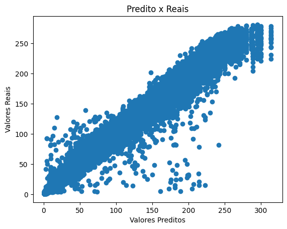

# 🚀 Ensembles do Zero — Random Forest & Gradient Boosting no Kaggle (Sem Bibliotecas de ML)

---

## 📌 Visão Geral

Este projeto implementa **modelos de ensemble do zero**, especificamente:

- 🌳 **Random Forest para regressão**
- 🚀 **Gradient Boosting para regressão**

sem utilizar **nenhuma biblioteca de Machine Learning** (como scikit-learn, xgboost, lightgbm, etc.).

O objetivo principal foi **entender profundamente como algoritmos de ensemble funcionam internamente**, desde a construção das árvores até o processo de otimização sequencial por gradiente.

Todo o pipeline foi implementado manualmente:

- Pré-processamento e normalização dos dados  
- Árvores de regressão (CART simplificada)  
- Bootstrap sampling (bagging) para Random Forest  
- Seleção aleatória de features (*m_try*)  
- Cálculo de resíduos (gradiente da perda) para Boosting  
- Ensemble de modelos  
- Grid Search com validação cruzada manual  
- Geração de submissão para o Kaggle  

---

## 🏆 Resultados no Kaggle

- ✅ **Public Score (LRMSE): 0.068**  
- ✅ **Private Score (LRMSE): 0.069**

A pequena diferença entre os scores indica **boa capacidade de generalização** e baixo overfitting ao leaderboard público.

---

## 📈 Resultados Visuais

### 📊 Predições vs Valores Reais

O modelo final de Gradient Boosting conseguiu capturar muito bem a relação entre os valores previstos e os valores reais:

---

### 🏅 Score no Kaggle

Print do leaderboard da competição:

---

## 🌳 Random Forest — Implementação do Zero

Foi implementada uma função completa de **Random Forest para regressão**, contendo:

- Bootstrap sampling (amostragem com reposição)
- Treinamento de múltiplas árvores independentes
- Seleção aleatória de subconjuntos de variáveis em cada split (*m_try*)
- Agregação das predições por média

O Random Forest foi utilizado como **modelo base de comparação** e também para guiar o espaço de busca dos hiperparâmetros do Gradient Boosting.

### 🔎 Grid Search com "Cross-Validation" Manual

Foi implementado um processo de **Grid Search manual**, com divisão treino/validação, avaliando:

- `n_estimators`
- `min_frac` (fração mínima de amostras por nó)
- `m_try` (no caso do RF)
- `learning_rate` (no caso do GB)
- `max_depth`

Cada combinação foi treinada e avaliada usando RMSE / LRMSE, de forma totalmente manual, sem bibliotecas prontas de validação cruzada.

---

### 🧮 Modelo Matemático — Gradient Boosting (forma conceitual)

O Gradient Boosting constrói um **modelo aditivo**, onde cada nova árvore corrige os erros das anteriores.

O modelo final pode ser representado conceitualmente como:

F(x) = ν * h1(x) + ν * h2(x) + ... + ν * hM(x)

onde:

- `h_m(x)` é a m-ésima árvore de regressão  
- `ν` (nu) é a taxa de aprendizado (*learning rate*)  
- `M` é o número total de árvores no ensemble  

---

Em cada iteração, calcula-se o **resíduo**, que corresponde ao gradiente negativo da função de perda em relação às predições atuais do modelo:

r_i = - dL(y_i, F(x_i)) / dF(x_i)

onde:

- `y_i` é o valor real  
- `F(x_i)` é a predição atual do ensemble  
- `L` é a função de perda (neste projeto, RMSLE)

Cada nova árvore é treinada para prever esses resíduos, e suas predições são adicionadas ao modelo existente, reduzindo progressivamente o erro.

---

## ⏱️ Custo Computacional — Treinamento de 22 Horas

O treinamento final do modelo levou aproximadamente:

> ⏳ **1300 minutos (~22 horas)**

Rodando em:

- CPU: Intel i5 (9ª geração)
- RAM: 8 GB
- Implementação puramente em Python + NumPy

Isso mostra que:

- ✔️ O algoritmo é **funcional e correto**
- ❌ Não é computacionalmente viável para produção sem otimizações em C/C++ (como nas libs do mercado)

Esse custo elevado vem principalmente de:

- Complexidade das árvores
- Número de estimadores
- Tamanho do dataset (centenas de milhares de linhas)
- Implementação sem paralelização

Mesmo assim, o experimento prova que é **possível implementar modelos de alto desempenho do zero**, ainda que com custo computacional alto.

---

## 🧠 Conceitos Implementados

- Análise Exploratória de Dados (EDA)
- Padronização de variáveis
- Árvores de Regressão (CART simplificada)
- Bagging (Bootstrap Aggregating)
- Random Forest
- Gradient Boosting
- Função de perda RMSLE
- Gradiente da função de perda
- Grid Search manual
- Avaliação com conjunto de validação
- Comparação entre modelos

---

## ⚙️ Tecnologias Utilizadas

- Python  
- NumPy  
- Pandas  
- Matplotlib  

🚫 Nenhuma biblioteca de Machine Learning foi utilizada para treinamento.

---

## 🎯 Conclusões

- O Gradient Boosting superou o Random Forest após ajuste de hiperparâmetros.
- O ganho final veio principalmente do:
  - Aumento do número de estimadores
  - Ajuste fino de profundidade das árvores
  - Uso de learning rate menor
- Melhorias futuras viriam principalmente de:
  - Feature engineering
  - Implementação mais eficiente (Cython / Numba / C++)
  - Uso de validação cruzada completa (k-fold)

O projeto teve foco **educacional e técnico**, visando entender profundamente algoritmos de ensemble utilizados em competições e no mercado.

---

## 👤 Autor

**Kauã Dias**  
Estudante de Estatística e entusiasta de Ciência de Dados

- 🐙 GitHub: https://github.com/Kauadp  
- 🔗 LinkedIn: https://www.linkedin.com/in/kauad/

---

## 📚 Referências Teóricas

[1] Friedman, J. H. (2001).  
**Greedy Function Approximation: A Gradient Boosting Machine**

[2] Breiman, L. (2001).  
**Random Forests**

[3] Hastie, T.; Tibshirani, R.; Friedman, J.  
**The Elements of Statistical Learning (ESL)** — Springer.

[4] James, G.; Witten, D.; Hastie, T.; Tibshirani, R.  
**An Introduction to Statistical Learning (ISLR)** — Springer.

[5] Lay, D. C.; Lay, S. R.; McDonald, J. J.  
**Álgebra Linear e Suas Aplicações** — Pearson.

[6] Stewart, J.  
**Cálculo — Volumes 1 e 2** — Cengage Learning.
